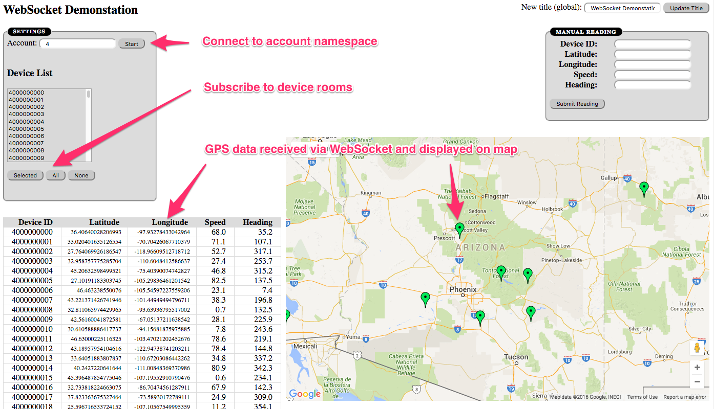

# WebSocket based GPS readings client/server

This project contains a simple WebSocket demonstation application that provides a global socket for all clients as well as namespace specific sockets with rooms within the namespaces.

In the demo application, the websocket server receives readings from GPS devices and publishes them to web clients.   The readings are separated into distinct accounts.  The clients will attach to a specific account feed using a WebSocket namespace and receive a list of active GPS devices for that account.  The user can select any number of devices to subscribe to (join the WebSocket room) get GPS readings from the subscribed devices.  The GPS locations are rendered on a Google Map in the web client and will move around as new locations are received.  The GPS readings can either be generated by an include simulator or read off an MQ queue using an included queue processor.

* The **client** will connect to an account namespace and then
subscribe to a specific rooms based for desired device updates.  As
new readings for that account are received it will update them in a
table.  Manual readings can also be submitted by the client.

* The **server** will receive readings and publish them.  Readings are
  published to the account specific namespaces where each device has a
  separate room.  This allows clients to subscribe to specific devices.

* The **queue processor** will pull in readings from a STOMP enabled
MQ queue and send them to the server for distribution to the clients.

* The **simulator** will generate randmon GPS information for
different accounts and device ids and send them to the server for
distribution to the clients.

## Installation

1. Clone the git repository

2. Install the node dependencies via `npm install`

## Usage

1. Update config.js as necessary.

2. Start up the websocket server `node ws_server.js`

3. Determine if you wish to pull readings from a queue, or simulate random readings:

  * To pull from a queue, start up the queue processor `node queue_processor.js`
  
  * To use the simulator either starting it up as a node process `node
simulator.js` or by opening a browser to `http://localhost:3700/simulator.html`.  Then press the "Start"
button.

4. Start up some clients by opening browser tabs to
`http://localhost:3700/`

5. Subscribe each client to an account.  Currently the simulator uses
account ids 1-10, so enter a value of 1-10 in the account field and
press 'Start'.  

